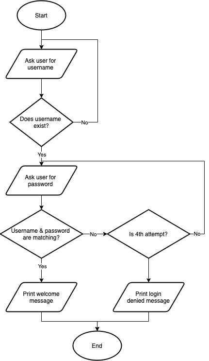

# Übungsaufgaben: Schleifen

## 1. Umwandlung for-Schleife in while-Schleife 

**Aufgabe:**

Gegeben ist folgender Codeausschnitt:

```python
names = ['Alice', 'Bob', 'Carol', 'Dave', 'Eve']
for name in names:
    print(names)
```

Setzen Sie die gleiche Funktionalität mithilfe einer `while`-Schleife um.


## 2. Das 1x1

**Aufgabe:**

Schreiben Sie ein Programm, bei dem der Nutzer zwei Integerwerte eingeben kann.

Anschließend soll anhand dieser beiden Zahlen eine Multiplikationstabelle ausgegeben werden.

Die 1. Zahl beschreibt den Multiplikanden, wird also z.B. die Zahl 13 eingegeben, soll die Multiplikationstabelle zur Zahl 13 ausgegeben werden.

Die 2. Zahl beschreibt, bis zu welchem Multiplikator die Multiplikationstabelle ausgegeben werden soll. Wird z.B. die Zahl 8 eingegeben, soll also das 13er - 1x1 bis zur Zahl 8 ausgegeben werden. Wird hier kein Wert eingegeben, soll als Multiplikator standardmäßig die Zahl 10 verwendet werden.

Die Ausgabe der Multiplikations soll nach folgendem Schema erfolgen:

    1 x 13 = 13
    2 x 13 = 26
    3 x 13 = 39
    ...
    8 x 13 = 104

## 3. Fizz Buzz

**Aufgabe:**

Schreiben Sie ein Programm, bei dem der Nutzer 4 Zahlen eingeben kann: `start`, `stop`, `div1`, `div2`. Für jede Zahl zwischen `start` und `stop` soll folgendes überprüft werden:

* Falls die Zahl durch `div1` und `div2` teilbar ist, soll "fizzbuzz" ausgegeben werden
* Falls die Zahl nur durch `div1` teilbar ist, soll "fizz" ausgegeben werden
* Falls die Zahl nur durch `div2` teilbar ist, soll "buzz" ausgegeben werden
* Andernfalls soll einfach die Zahl ausgegeben werden

## 4. Fakultät

**Aufgabe:**

Schreiben Sie ein Programm, bei dem der Nutzer eine Zahl eingibt und anschließend die Fakultät dieser Zahl berechnet und ausgegeben wird

## 5. String Ausgabe

**Aufgabe:**

Schreiben Sie ein Programm, bei dem der Nutzer ein Wort eingeben kann und anschließend jeder 2. Buchstabe ausgegeben wird. Die Ausgabe soll in einer einzigen Zeile erfolgen.

## 6. String Ausgabe II

**Aufgabe:**

Schreiben Sie ein Programm, bei dem der Nutzer mehrere Wörter eingeben kann und anschließend jedes 2. Wort ausgegeben wird. Die Ausgabe soll in einer einzigen Zeile erfolgen.

## 7. Quersumme

**Aufgabe:**

Schreiben Sie ein Programm, bei dem der Nutzer eine Zahl eingibt und anschließend die Quersumme dieser Zahl berechnet und ausgegeben wird.                    

## 8. Einkaufsliste

**Aufgabe:**

Schreiben Sie ein Programm, das eine Einkaufsliste abbildet.

Der Nutzer soll wiederholt nach Dingen gefragt werden, die in einer Einkaufsliste gespeichert werden sollen.

Wenn der Nutzer "X" eingibt soll die Abfrage beendet werden und die Einkaufsliste ausgegeben werden (1 Item pro Zeile)

## 9. Mathematische Formel

**Aufgabe:**

Schreiben Sie ein Programm, bei dem der Nutzer eine Ganzzahl k >= 1 eingeben kann, anschließend soll folgende Gleichung berechnet und das Ergebnis wieder ausgegeben werden:


## 10. Heron-Verfahren

**Beschreibung**

Zur Berechnung einer Wurzel gibt es in Python verschiedene Verfahren, z.B. kann  durch  berechnet werden,
```python
5**(1/3)
```

für Quadratwurzeln kann auch die `math` Bibliothek genutzt werden:

```python
import math

math.sqrt(4) # Quadratwurzel von 4
```

Das Heron-Verfahren, oder auch babylonisches Wurzelziehen genannt, ist ein altes Verfahren zur Annäherung der Quadratwurzel einer reellen Zahl n > 0.

Hierzu werden zunächst zwei Näherungswerte bestimmt, bspw. `a=1` und `b=n`. 

Folgende Schritte werden angewendet, bis `a` und `b` annähernd gleich sind:

* Weise `a` den Mittelwert aus `a` und `b` der vorherigen Iteration zu.
* Weise `b` dem Wert der Division mit Dividend `a` und Divisor `n` zu.


**Aufgabe** 

Implementieren Sie das Heron-Verfahren für verschiedene Werte.

Der Nutzer soll hierfür den Wert, für den die Quadratwurzel berechnet werden soll, eingeben können. 

Betrachten Sie den Algorithmus als terminiert, sofern der Betrag der Differenz der beiden Näherungswerte < 0.001 ist, spätestens jedoch nach 15 Iterationen.

Geben Sie am Ende beide Näherungswerte sowie die Differenz zum tatsächlichen Wert aus.

**Erweiterung**

Der Nutzer soll auch die Werte `a` und `b` durch Eingabe bestimmen können.


## 11. Zahlenraten

**Aufgabe:**

Das Programm soll zunächst eine Zufallszahl zwischen 0 und 100 erzeugen.
Anschließend wird der Nutzer wiederholt nach seinem Tipp für die entsprechende Zahl gefragt. Liegt die geratene Zahl des Nutzers über der tatsächlichen Zahl, erfolgt als Ausgabe "Zu hoch", falls sie niedriger ist erfolgt als Ausgabe "Zu niedrig". Diese Abfrage erfolgt solange, bis die Zahl korrekt erraten wurde, in diesem Fall soll ausgegeben werden, wie viele Versuche benötigt wurden.

**Hinweis:**

Eine Zufallszahl kann mithilfe der eingebauten `random`-Bibliothek erzeugt werden. Diese stellt die Funktion `randint()` zur Erzeugung einer ganzzahligen Zufallszahl zur Verfügung. 
```python
import random

# Erzeugen einer ganzzahligen Zufallszahl zwischen 5 und 10
random_number = random.randint(5, 10)
```

## 12. Spielkarten

**Aufgabe 1**

Geben Sie alle 52 Spielkarten eines französischen Kartendecks mithilfe von Listen und geschachtelten Schleifen aus.

Die Ausgabe soll folgendermaßen  erfolgen:

♥A, ♥K, ♥Q, ♥J, ♥10, ..., ♥2, ♦A, ... ♦2, ♣A, ..., ♣2, ♠A, ..., ♠2

**Aufgabe 2**

Erzeugen Sie wie in Aufgabe 1 sämltliche Kartenkombinationen und speichern Sie diese in einer Liste ab.

Nun durchmischen Sie diese Liste zufällig. Der Nutzer kann nun eine Zahl zwischen 1 und 52 eingeben, die entsprechende Karte wird aus dem Stapel gezogen und dem Nutzer präsentiert.

**Hinweis**

Für das zufällige Durchmischen einer Liste existiert bereits eine Funktion in Python. Hierfür benötigen Sie das eingebaute Modul `random`, das zunächst importiert werden muss:

```python
import random
```

Finden Sie heraus, welche die passende Funktion im `random`-Modul ist.

## 13. Fibonacci

**Beschreibung:**

Die Fibonacci-Reihe beschreibt eine Zahlenreihe, die häufig in der Natur auftretende Wachstumsvorgänge darstellt. Leonardo Fibonacci, nach dem die Reihe benannt wurde, erklärte damit den Wachstum von Kaninchenpopulationen.

Die Reihe beginnt zweimal mit der Zahl 1. Jede weitere Zahl wird durch die Summe der beiden jeweils vorhergehenden Zahlen gebildet. Die nächste Zahl der Reihe ist also 2 (1 + 1). Fortgeführt wird sie durch 3 (1 + 2), 5 (3 + 2), 8 (5 + 3), ...

Häufig wird die Reihe auch durch eine führende 0 begonnen.

**Aufgabe:**

Schreiben Sie ein Programm, das die Fibonacci-Zahlen zwischen 0 und einer vom Nutzer durch eine Eingabe bestimmten Zahl ausgibt.


## 14. Vokabeltrainer

**Aufgabe:**

Erstellen Sie einen Vokabeltrainer. Nehmen Sie hierfür folgendes Dictionary als Grundlage und erweitern Sie dieses nach Belieben:
```python
vocabulary = [
    {"de": "Pferd", "en": "horse"},
    {"de": "Kuh", "en": "cow"},
    {"de": "Hund", "en": "dog"},
    {"de": "Katze", "en": "cat"},
    {"de": "Banane", "en": "banana"},
    {"de": "Erdbeere", "en": "strawberry"},
    {"de": "Apfel", "en": "apple"}
]
```

Mischen Sie die Vokablen zunächst in zufälliger Reihenfolge. Anschließend wird der Nutzer für jeden Eintrag zufällig nach der deutschen oder englischen Übersetzung des jeweiligen Wortes gefragt. 

Entsprechend der Eingabe soll eine Ausgabe erfolgen ("Die Übersetzung ist (nicht) korrekt"). Außerdem soll die korrekte Übersetzung ausgegeben werden, falls die Eingabe des Nutzers nicht richtig war. 

Schlussendlich soll eine Auswertung erfolgen ("X/Y Übersetzungen richtig (Z%)").

**Hinweise:**

Für das zufällige Durchmischen einer Liste existiert bereits eine Funktion in Python. Hierfür benötigen Sie das eingebaute Modul `random`, das zunächst importiert werden muss. Finden Sie heraus, welche die passende Funktion im `random`-Modul ist.
Zur Erzeugung von Zufallszahlen kann ebenfalls die `random`-Bibliohthek genutzt werden:

```python
import random

# Erzeugung einer zufälligen Fließkommazhal zwischen 0  und 1
random_float = random.random()
```

## 15. Teilbarkeit

**Aufgabe:**

Schreiben Sie ein Programm, bei dem über die Zahlen von 1 bis 100 iteriert wird. Erzeugen Sie ein Dictionary mit den den Ziffern von 1 bis 9 als Keys. 

Falls die jeweilige Zahl des Loops durch 1 teilbar ist, speichere diese Zahl in einer Liste unter dem Key "1". Falls die Zahl durch 2 teilbar ist, speichere diese Zahl in einer Liste unter dem Key "2" usw.

Geben Sie das Dictionary am Ende aus.

## 16. Login System

**Beschreibung:**

Die Benutzung Ihres Programms ist lediglich den Nutzern vorbehalten, die sich vor der Nutzung authentifizieren, sich also mit Nutzernamen und Passwort anmelden. Nur wenn die Nutzername/Passwort-Kombination übereinstimmt, darf das Programm ausgeführt werden.

**Aufgabe 1:**

Gegeben seien folgende Nutzername-Passwort Kombinationen:

```python
users = [
    {
        "username": "Celina",
        "password": "111111"
    },
    {
        "username": "Patrick",
        "password": "1234567"
    },
    {
        "username": "Nina",
        "password": "qwertz"
    },
    {
        "username": "Sebastian",
        "password": "abc123"
    },
    {
        "username": "Anna-Lena",
        "password": "1122334455"
    }
]
```

Implementieren Sie ein Programm, das den folgenden Programmablaufplan wiederspiegelt:




**Aufgabe 2:**

In vorheriger Aufgabe wird der Nutzer unbegrenzt häufig nach seinem Nutzernamen gefragt, sollte dieser nicht bekannt sein. Erweitern Sie das Programm nun so, dass der Nutzer gefragt wird, ob ein neuer Nutzer erstellt werden soll, sollte der eingegebene Nutzername nicht bekannt sein. Antwortet der Nutzer mit "Nein", beginnt der Ablauf von vorne und der Nutzer wird erneut nach seinem Nutzernamen gefragt. Antwortet er jedoch mit "Ja", wird er nach dem zugehörigen Passwort gefragt. Dieses Passwort muss 2 Mal identisch eingegeben werden, um Tippfehler zu vermeiden. Weichen die Passwörter voneinander ab, wird der Nutzer darauf hingewiesen und er muss das Passwort erneut 2 Mal eingeben. Stimmen diese überein, wird der Nutzer zu der Liste der existierenden Nutzer hinzugefügt. Nun wurde der neue Nutzer angelegt, er ist jedoch noch nicht eingeloggt. Daher folgt nun der Loginprozess analog zu Aufgabe 1.

Erstellen Sie für diesen beschriebenen Anwendungsfall ein Programmablaufsdiagramm wie in Aufgabe 1 und implementieren Sie entsprechend die Funktioalität.